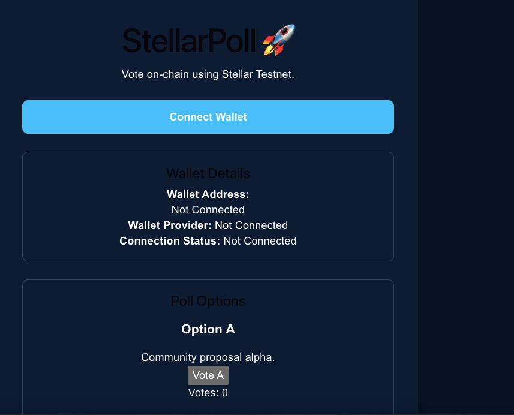
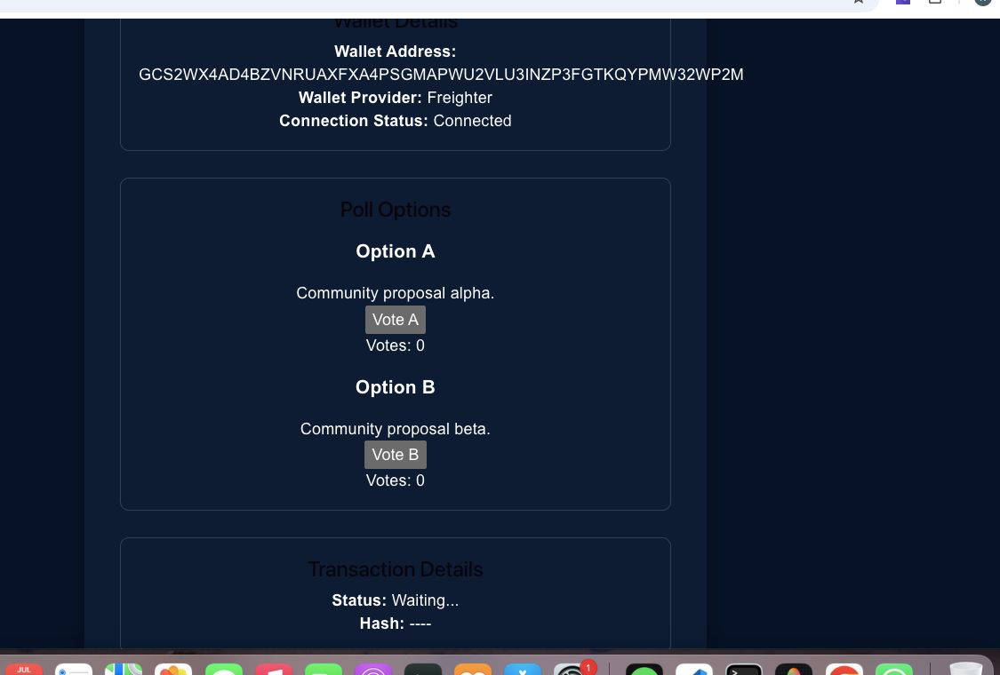
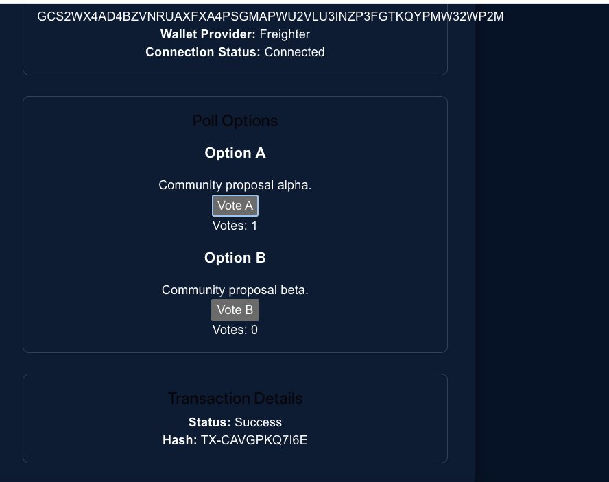
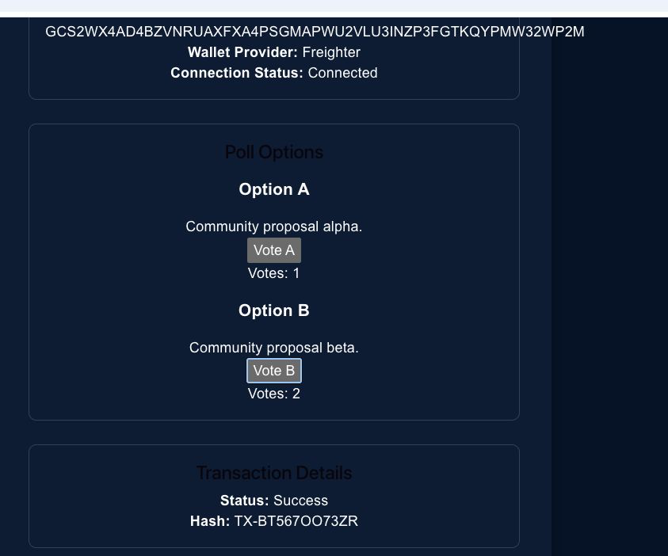

# StellarPoll 🚀

A decentralized voting application built on the Stellar Soroban smart contract framework for the Stellar Yellow Belt Program.

## Stellar Testnet Deployment

- **Network**: Stellar Testnet
- **Contract ID**: `CAHHWOXXL3H3A2YCR2DVXMZDN7VRJL5JTQ5TZ2YNFODF2C6EI6IAQLC4`
- **Contract Explorer**: [Stellar Expert Contract Explorer](https://stellar.expert/explorer/testnet/contract/CAHHWOXXL3H3A2YCR2DVXMZDN7VRJL5JTQ5TZ2YNFODF2C6EI6IAQLC4)
- **Deployment Tx Hash**: `9fba1ac0a22c6f8f66d285456ac27a7729f9ee752ba6e08377b626a6d4602c61`
- **Verified Interaction Tx Hash**: [Stellar Expert Tx Explorer](https://stellar.expert/explorer/testnet/tx/4a9669d8ccd710795bbc41d01d4b8fe44b73c81e555b871b688e6b5f30ea1e6f)

---

## Live Demo

https://stellar-white-belt-git-yellow-belt-sarvodayas-projects.vercel.app

## GitHub Repository

https://github.com/Karmansingh09/stellar-white-belt

---

## Features

- **Soroban Smart Contract Integration**: Direct on-chain interactions with contract methods (`vote_a`, `vote_b`, `get_votes`).
- **Real Freighter Wallet Integration**: Connect using `@stellar/freighter-api` to fetch the actual public key and sign transactions.
- **On-Chain Vote Storage**: Real-time reading and updating of votes directly from Stellar Testnet storage.
- **Real Transaction Hashes**: Live submission to Testnet RPC returning real transaction hashes linked to Stellar Expert.
- **Transaction Status Tracking**: Real-time status updates (Building, Simulating, Signing, Submitting, Confirmed).
- **Modern Responsive UI**: Styled with glassmorphism, dynamic animations, and dark mode design aesthetics.

---

## Tech Stack

- **Smart Contract**: Rust, Soroban SDK (`soroban-sdk` v26)
- **Frontend Framework**: React, Vite, JavaScript
- **Stellar SDK**: `@stellar/stellar-sdk` v16
- **Wallet Provider**: `@stellar/freighter-api` v6
- **Styling**: Tailwind CSS, Framer Motion, Lucide Icons

---

## Smart Contract Architecture

The Soroban smart contract is located in `voting-contract/contracts/hello-world`:

```rust
pub fn vote_a(env: Env) -> u32
pub fn vote_b(env: Env) -> u32
pub fn get_votes(env: Env) -> (u32, u32)
```

---

## Screenshots

### Home Page



### Wallet Connected



### Vote A



### Vote B



### Transaction Hash


---

## Installation & Setup

```bash
git clone https://github.com/Karmansingh09/stellar-white-belt.git
cd stellar-white-belt
npm install
npm run dev
```

## Project Structure

```text
voting-contract/
└── contracts/
    └── hello-world/
        └── src/
            ├── lib.rs       # Soroban voting smart contract
            └── test.rs      # Unit tests

src/
├── services/
│   └── stellar.js           # Soroban contract RPC & Freighter integration
├── components/
│   ├── VotingCard.jsx       # Voting interface (vote_a, vote_b, get_votes)
│   ├── WalletCard.jsx       # Real Freighter wallet details & status
│   ├── Navbar.jsx           # Wallet connection header
│   ├── TransactionTable.jsx # Real transaction history
│   └── Footer.jsx
├── App.jsx
├── App.css
├── index.css
└── main.jsx
```

---

## Yellow Belt Requirements

- [x] GitHub Repository
- [x] Smart Contract Deployment on Stellar Testnet (`CAHHWOXXL3H3A2YCR2DVXMZDN7VRJL5JTQ5TZ2YNFODF2C6EI6IAQLC4`)
- [x] Real Freighter Wallet Integration (`@stellar/freighter-api`)
- [x] Soroban Smart Contract Voting Interface (`vote_a`, `vote_b`, `get_votes`)
- [x] Live Transaction Status & Confirmed Hash Display
- [x] README Testnet Deployment Section Included

---

## Author

### Karman Singh Chandhok

- GitHub: https://github.com/Karmansingh09
- LinkedIn: https://www.linkedin.com/in/karman-singh-chandhok-b1262337b

---

Built for the Stellar Yellow Belt Program ⭐